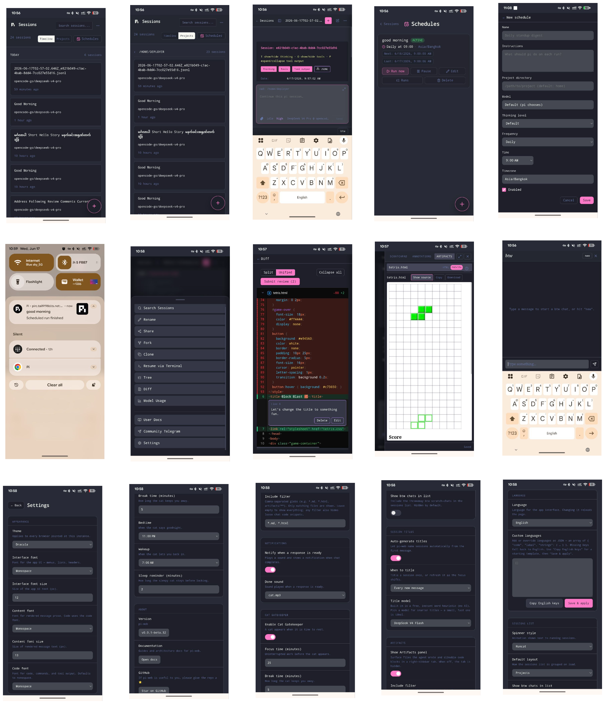

# Selamat Datang di pi-web 🖥️

[English](../en/README.md) · [Español](../es/README.md) · [Français](../fr/README.md) · [Deutsch](../de/README.md) · [中文](../zh/README.md) · [日本語](../ja/README.md) · **Bahasa Indonesia** · [Bahasa Melayu](../ms/README.md) · [Tiếng Việt](../vi/README.md) · [ไทย](../th/README.md) · [Filipino](../fil/README.md) · [မြန်မာ](../my/README.md) · [ភាសាខ្មែរ](../km/README.md) · [ລາວ](../lo/README.md)

**Berpikir untuk mencoba pi-web? Langsung saja — Anda akan jatuh cinta.**

pi-web adalah antarmuka web dan PWA yang indah untuk [pi](https://pi.dev) — agen coding AI sumber terbuka. Ini memungkinkan Anda menjelajahi, membaca, dan melanjutkan sesi pi dari peramban apa pun, di perangkat apa pun, dengan fitur-fitur cermat di setiap langkah.

**pi-web dibangun untuk dua jenis orang:**

- 🧑‍💻 **Untuk pengembang** — yang hidup di terminal tetapi ingin melanjutkan sesi dari ponsel, menyerahkan ke server jarak jauh, atau memantau tugas yang berjalan lama dari mana saja.
- ✨ **Untuk non-pengembang** — yang hanya menginginkan aplikasi AI yang indah dan berfungsi. Buka, ketik, nikmati. Tanpa terminal, tanpa SSH, tanpa kebingungan. Seperti alat AI yang paling ramah pengguna, tetapi dengan pilihan model dan kebebasan sumber terbuka.

---

## Mengapa pi-web?

Anda sudah asyik bekerja dengan pi di terminal Anda. pi-web menjaga momentum itu tetap berjalan saat Anda beranjak dari meja:

- **Lanjutkan dari mana saja** — lanjutkan sesi dari ponsel, tablet, atau komputer lain. Tanpa SSH, tanpa Termius — cukup buka peramban Anda.
- **Dasbor multi-sesi** — mulai pekerjaan di satu sesi sambil menonton sesi lain berjalan. Cari di seluruh proyek, filter berdasarkan cabang, temukan yang Anda butuhkan dengan cepat.
- **Fondasi sumber terbuka** — pi sepenuhnya sumber terbuka dan agnostik penyedia. Anda tidak terkunci pada satu model atau vendor. pi-web juga sumber terbuka.
- **Akses jarak jauh yang aman** — otentikasi token bawaan sehingga Anda bisa mengeksposnya di LAN atau Tailscale tanpa khawatir.
- **Bagikan hasil kerja Anda** — ekspor sesi sebagai snapshot statis atau GitHub Gist rahasia dalam satu klik.

> Penasaran dengan cerita di baliknya? [Baca mengapa kami membangunnya →](why.md)

---

## pi-web sebagai ruang kerja AI pribadi Anda 🏠

pi-web adalah PWA (Progressive Web App), jadi Anda bisa **menginstalnya seperti aplikasi native** di desktop, laptop, ponsel, atau tablet — tanpa perlu toko aplikasi. Di desktop, ini terbuka di jendelanya sendiri tanpa chrome peramban, jadi terlihat dan terasa seperti aplikasi desktop sungguhan.

Anggap ini sebagai **Claude Cowork Anda sendiri** — ruang kerja AI pribadi yang tinggal di mesin Anda — hanya saja ini sumber terbuka dan agnostik model:

- **Anda pemilik tumpukannya.** Pilih model apa pun, beralih kapan saja. Jalankan model lokal dan data Anda tidak pernah meninggalkan mesin Anda.
- **Orang non-teknis bisa menggunakannya.** Atur pi-web di mesin mereka, tunjukkan cara menggunakannya sekali, dan mereka siap. Orang tua Anda, pasangan Anda, teman non-teknis Anda — tanpa terminal, tanpa SSH, cukup antarmuka obrolan yang familiar.
- **Satu pengaturan, banyak pengguna.** Instal di desktop Anda dan bagikan layar Anda, atau ekspos di jaringan rumah Anda dan biarkan anggota keluarga membukanya di perangkat mereka sendiri.

Ingin lebih dari sekadar coding? Ubah menjadi [asisten pribadi](personal-assistant.md) khusus yang tahu siapa Anda dan tinggal di mesin Anda — seperti OpenClaw atau Hermes Anda sendiri.

> 💡 **Tips pro:** Instal pi-web sebagai PWA dari Chrome/Edge (klik ikon instal di bilah alamat) atau Safari (Bagikan → Tambah ke Dock). Ini menjadi tidak bisa dibedakan dari aplikasi native.

---

## Yang bisa Anda lakukan dengan pi-web

| | |
|---|---|
| 📱 **PWA** | Instal pi-web sebagai Progressive Web App di desktop, ponsel, atau tablet untuk nuansa native. |
| 🔄 **Lanjutkan sesi** | Lanjutkan percakapan apa pun tepat di tempat Anda tinggalkan — teks, gambar, pergantian model, semua dari peramban. |
| 🆕 **Mulai sesi baru** | Buat sesi baru di jalur proyek mana pun, langsung dari UI web. |
| 📡 **Streaming langsung** | Tonton respons pi mengalir secara real-time dengan latensi ~ms. Mode ikuti mengunci Anda pada yang terbaru. |
| 🌲 **Tampilan pohon** | Jelajahi pohon pesan native pi — lihat struktur percakapan lengkap, lompat ke cabang mana pun, dan cabangkan dari titik mana pun. |
| 🔀 **Cabangkan sesi** | Cabangkan sesi dari pesan mana pun atau bahkan panggilan alat tertentu — jelajahi arah berbeda tanpa kehilangan tempat Anda. |
| 🔍 **Jelajah & cari** | Filter sesi di seluruh proyek, cari berdasarkan nama, navigasikan cabang — riwayat sesi lengkap Anda dalam sekejap. |
| 🌿 **Integrasi Git** | Lihat cabang saat ini dan buka PR GitHub langsung dari penampil sesi. |
| 📝 **Catatan** | Tulis catatan, daftar tugas, atau pemikiran cepat di samping sesi Anda tanpa berpindah aplikasi. |
| 💬 **Anotasi** | Sorot dan komentari bagian mana pun dari sesi — bagus untuk tinjauan kode, umpan balik, atau menandai momen penting. |
| 🎨 **Tema & kustomisasi** | Beralih antara mode gelap dan terang, sesuaikan UI sesuai selera — buat pi-web terasa seperti *milik Anda*. |
| 🌐 **Multi-bahasa** | 14 bahasa bawaan (English, Español, Français, Deutsch, 中文, 日本語, Bahasa Indonesia, Bahasa Melayu, Tiếng Việt, ไทย, Filipino, မြန်မာ, ភាសាខ្មែរ, ລາວ). Tambahkan bahasa kustom Anda sendiri dari Pengaturan. |
| 🐱 **Kesehatan & pomodoro** | Terlalu banyak vibe coding tidak sehat. Timer pomodoro bawaan dengan teman kucing dan pengingat tidur untuk menjaga keseimbangan Anda. |
| 📤 **Bagikan & ekspor** | Unduh JSONL, ekspor snapshot statis yang dirender dengan tampilan native `pi.dev` dari pi, atau bagikan sebagai GitHub Gist pribadi — semua dirender sisi klien. |
| 🔔 **Suara notifikasi** | Suara notifikasi yang dapat disesuaikan untuk acara sesi — tetap terhubung bahkan saat pi-web ada di tab lain. |
| ⌨️ **Pintasan keyboard** | Navigasi ala Vim, aksi cepat — [referensi lengkap →](keyboard-shortcuts.md) |
| 🤖 **Asisten pribadi** | Ubah pi-web menjadi asisten AI Anda sendiri yang tinggal di komputer Anda — seperti OpenClaw atau Hermes. [Atur →](personal-assistant.md) |

---

## Navigasi cepat

| Jika Anda mencari… | Baca |
|---|---|
| Cara menginstal, mengkonfigurasi, dan menggunakan pi-web | [install.md](install.md) |
| Menggunakan pi-web sebagai asisten pribadi | [personal-assistant.md](personal-assistant.md) |
| Referensi pintasan keyboard | [keyboard-shortcuts.md](keyboard-shortcuts.md) |
| Mengapa pi-web ada | [why.md](why.md) |
| Yang akan datang selanjutnya | [roadmap.md](roadmap.md) |
| Mengalami masalah instalasi? Biarkan LLM Anda memperbaikinya — tempelkan tautan llm-debug.md ke mereka | [llm-debug.md](llm-debug.md) |

---

## Tangkapan Layar

| Desktop | PWA Seluler |
|---|---|
|  |  |

---

## 💛 Dukung

pi-web dibangun dengan cinta dan banyak malam tanpa tidur. Saya membayar paket coding (Claude Code, OpenCode, dll.) dari kantong sendiri untuk menjaga proyek ini tetap berjalan. Jika pi-web telah bermanfaat bagi Anda, dukungan Anda sangat berarti.

**Cara membantu:**

- 💰 **[Sponsor di GitHub](https://github.com/sponsors/setkyar)** — bantu menutupi biaya alat yang memungkinkan ini
- ☕ **[Traktir saya kopi](https://buymeacoffee.com/setkyar)** — setiap sedikit bantuan berarti
- ⭐ **Bintangi repo** — tidak ada biaya dan membantu lebih banyak orang menemukan pi-web
- 📢 **Bagikan dengan teman & keluarga** — jika Anda kenal seseorang yang akan menyukai pi-web, kirimkan ke mereka

Tidak bisa mensponsori? Tidak masalah sama sekali — sebuah bintang dan share sangat berarti. Terima kasih telah berada di sini. 🙏

---

Selamat coding! 🚀
