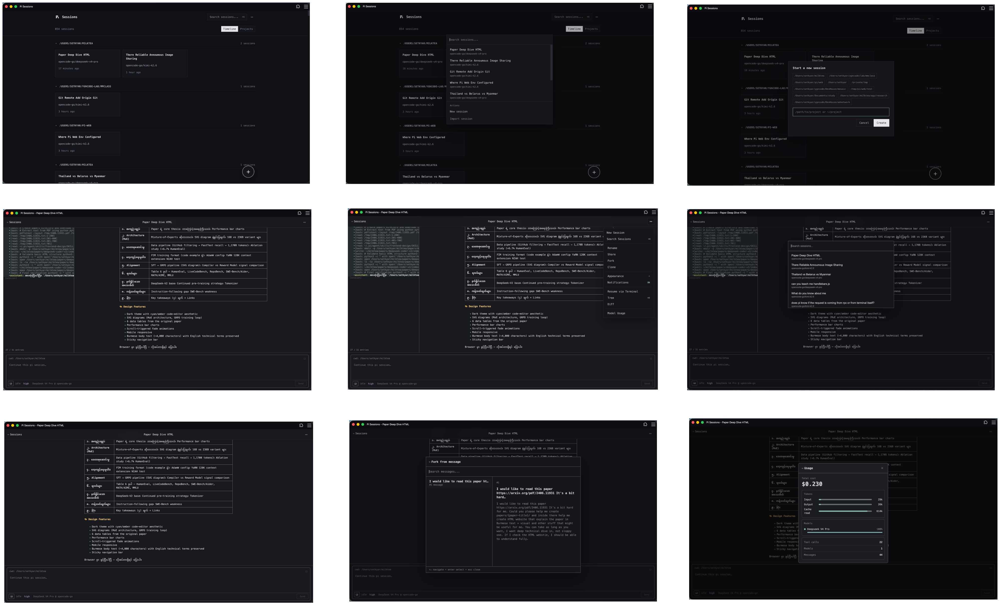
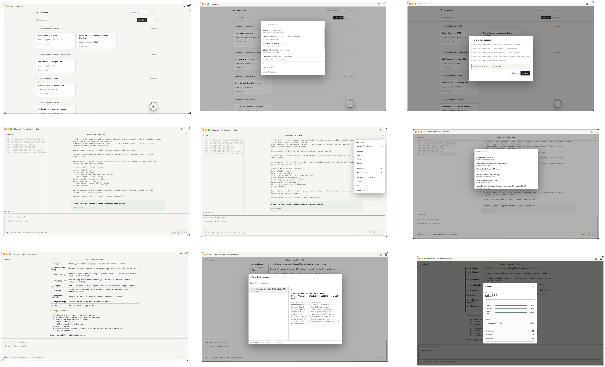
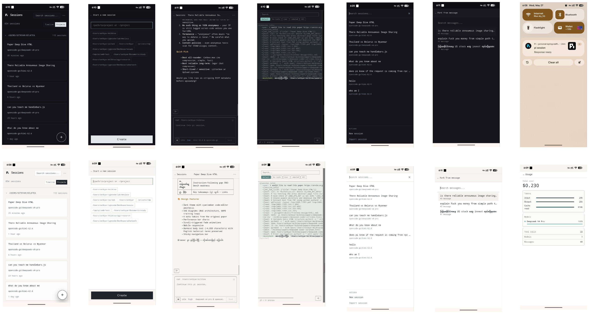

# ยินดีต้อนรับสู่ pi-web 🖥️

[English](../en/README.md) · [Español](../es/README.md) · [Français](../fr/README.md) · [Deutsch](../de/README.md) · [中文](../zh/README.md) · [日本語](../ja/README.md) · [Bahasa Indonesia](../id/README.md) · [Bahasa Melayu](../ms/README.md) · [Tiếng Việt](../vi/README.md) · **ไทย** · [Filipino](../fil/README.md) · [မြန်မာ](../my/README.md) · [ភាសាខ្មែរ](../km/README.md) · [ລາວ](../lo/README.md)

**กำลังคิดจะลอง pi-web อยู่หรือเปล่า? ลุยเลย — คุณจะต้องหลงรักมันแน่ๆ**

pi-web คือ UI บนเว็บและ PWA ที่สวยงามสำหรับ [pi](https://pi.dev) — เครื่องมือ AI coding agent แบบโอเพนซอร์ส มันช่วยให้คุณเรียกดู อ่าน และสานต่อเซสชัน pi ของคุณจากเบราว์เซอร์ใดก็ได้ บนอุปกรณ์ใดก็ได้ พร้อมฟีเจอร์ที่คิดมาอย่างดีในทุกจุด

**pi-web สร้างขึ้นสำหรับคนสองกลุ่ม:**

- 🧑‍💻 **สำหรับนักพัฒนา** — คนที่ใช้ชีวิตอยู่ในเทอร์มินัลแต่อยากสานต่อเซสชันจากมือถือ ส่งต่อไปยังเซิร์ฟเวอร์ระยะไกล หรือเฝ้าดูงานที่รันนานๆ จากทุกที่
- ✨ **สำหรับคนที่ไม่ใช่นักพัฒนา** — คนที่แค่อยากได้แอป AI สวยๆ ที่ใช้งานได้จริง เปิด พิมพ์ แล้วก็ลุย ไม่ต้องใช้เทอร์มินัล ไม่ต้อง SSH ไม่ต้องงง เหมือนเครื่องมือ AI ที่ใช้งานง่ายที่สุด แต่มีอิสระในการเลือกโมเดลและเป็นโอเพนซอร์ส

---

## ทำไมต้อง pi-web?

คุณกำลังติดลมกับ pi ในเทอร์มินัล pi-web ช่วยให้โมเมนตัมนั้นเดินต่อไปเมื่อคุณก้าวออกจากโต๊ะทำงาน:

- **สานต่อจากทุกที่** — เล่นเซสชันต่อจากมือถือ แท็บเล็ต หรือคอมพิวเตอร์อีกเครื่อง ไม่ต้อง SSH ไม่ต้อง Termius — แค่เปิดเบราว์เซอร์
- **แดชบอร์ดหลายเซสชัน** — เริ่มงานในเซสชันหนึ่งขณะดูอีกเซสชันสตรีมอยู่ ค้นหาข้ามโปรเจกต์ กรองตาม branch หาสิ่งที่ต้องการได้เร็ว
- **รากฐานโอเพนซอร์ส** — pi เป็นโอเพนซอร์สเต็มตัวและไม่ยึดติดผู้ให้บริการ คุณไม่ได้ถูกผูกขาดกับโมเดลหรือผู้ขายรายเดียว pi-web ก็โอเพนซอร์สเช่นกัน
- **การเข้าถึงระยะไกลที่ปลอดภัย** — มีการยืนยันด้วยโทเคนในตัว คุณจึงเปิดให้เข้าถึงผ่าน LAN หรือ Tailscale ได้โดยไม่ต้องกังวล
- **แชร์งานของคุณ** — ส่งออกเซสชันเป็นสแนปชอตแบบ static หรือ GitHub Gist ส่วนตัวได้ในคลิกเดียว

> อยากรู้ที่มาที่ไป? [อ่านว่าทำไมเราถึงสร้างมัน →](why.md)

---

## pi-web ในฐานะพื้นที่ทำงาน AI ส่วนตัวของคุณ 🏠

pi-web เป็น PWA (Progressive Web App) คุณจึงสามารถ **ติดตั้งเหมือนแอปเนทีฟ** บนเดสก์ท็อป แล็ปท็อป มือถือ หรือแท็บเล็ต — ไม่ต้องใช้ app store บนเดสก์ท็อปมันเปิดในหน้าต่างของตัวเองโดยไม่มีกรอบเบราว์เซอร์ มันจึงดูและให้ความรู้สึกเหมือนแอปพลิเคชันเดสก์ท็อปของจริง

คิดเสียว่าเป็น **Claude Cowork ของคุณเอง** — พื้นที่ทำงาน AI ส่วนตัวที่อยู่บนเครื่องของคุณ — เพียงแต่มันเป็นโอเพนซอร์สและไม่ยึดติดโมเดล:

- **คุณเป็นเจ้าของทั้งระบบ.** เลือกโมเดลใดก็ได้ เปลี่ยนเมื่อไหร่ก็ได้ตามใจ รันโมเดลท้องถิ่นแล้วข้อมูลคุณก็ไม่เคยออกจากเครื่อง
- **คนที่ไม่ใช่สายเทคนิคก็ใช้ได้.** ติดตั้ง pi-web บนเครื่องของพวกเขา สาธิตวิธีใช้ให้ดูครั้งเดียว ก็พร้อมใช้งานแล้ว พ่อแม่ คู่ชีวิต เพื่อนที่ไม่ใช่สายเทค — ไม่ต้องใช้เทอร์มินัล ไม่ต้อง SSH แค่อินเทอร์เฟซแชทที่คุ้นเคย
- **ติดตั้งครั้งเดียว หลายผู้ใช้.** ติดตั้งบนเดสก์ท็อปแล้วแชร์หน้าจอ หรือเปิดบนเครือข่ายบ้านแล้วให้สมาชิกครอบครัวเปิดบนอุปกรณ์ของตัวเอง

อยากได้มากกว่าเขียนโค้ด? เปลี่ยนให้เป็น [ผู้ช่วยส่วนตัว](personal-assistant.md) ที่รู้จักคุณและอาศัยอยู่บนเครื่องของคุณ — เหมือน OpenClaw หรือ Hermes ของคุณเอง

> 💡 **ทิปขั้นเทพ:** ติดตั้ง pi-web เป็น PWA จาก Chrome/Edge (คลิกไอคอนติดตั้งในแถบที่อยู่) หรือ Safari (แชร์ → เพิ่มลง Dock) มันจะแยกไม่ออกจากแอปเนทีฟเลย

---

## สิ่งที่คุณทำได้กับ pi-web

| | |
|---|---|
| 📱 **PWA** | ติดตั้ง pi-web เป็น Progressive Web App บนเดสก์ท็อป มือถือ หรือแท็บเล็ต ให้ความรู้สึกแบบเนทีฟ |
| 🔄 **สานต่อเซสชัน** | เล่นบทสนทนาใดๆ ต่อจากจุดที่ค้างไว้ — ข้อความ รูปภาพ การสลับโมเดล ทั้งหมดจากเบราว์เซอร์ |
| 🆕 **เริ่มเซสชันใหม่** | สร้างเซสชันใหม่บนพาธโปรเจกต์ใดๆ ได้โดยตรงจาก UI บนเว็บ |
| 📡 **สตรีมสด** | ดูการตอบกลับของ pi สตรีมแบบเรียลไทม์ด้วยความหน่วงระดับ ~ms โหมด Follow ช่วยให้คุณอยู่กับข้อความล่าสุดเสมอ |
| 🌲 **มุมมองแบบต้นไม้** | นำทางแผนภูมิบทสนทนาแบบเนทีฟของ pi — ดูโครงสร้างบทสนทนาทั้งหมด กระโดดไปยัง branch ใดๆ และ fork จากจุดใดก็ได้ |
| 🔀 **Fork เซสชัน** | Fork เซสชันจากข้อความใดๆ หรือแม้แต่ tool call ที่เฉพาะเจาะจง — สำรวจทิศทางต่างๆ โดยไม่เสียตำแหน่งเดิม |
| 🔍 **เรียกดู & ค้นหา** | กรองเซสชันข้ามโปรเจกต์ ค้นหาตามชื่อ นำทาง branch ต่างๆ — ประวัติเซสชันทั้งหมดของคุณในพริบตา |
| 🌿 **Git integration** | ดู branch ปัจจุบันและเปิด GitHub PR ได้โดยตรงจากตัวแสดงเซสชัน |
| 📝 **Scratchpad** | จดบันทึก รายการสิ่งที่ต้องทำ หรือความคิดเร็วๆ เคียงข้างเซสชันของคุณโดยไม่ต้องสลับแอป |
| 💬 **Annotations** | ไฮไลต์และคอมเมนต์ส่วนใดๆ ของเซสชัน — เหมาะสำหรับการรีวิวโค้ด ให้ฟีดแบ็ก หรือบุ๊กมาร์กช่วงสำคัญ |
| 🎨 **ธีม & การปรับแต่ง** | สลับระหว่างโหมดมืดและสว่าง ปรับแต่ง UI ตามใจ — ทำให้ pi-web รู้สึกเหมือนเป็น *ของคุณ* |
| 🌐 **หลายภาษา** | มี 14 ภาษาในตัว (English, Español, Français, Deutsch, 中文, 日本語, Bahasa Indonesia, Bahasa Melayu, Tiếng Việt, ไทย, Filipino, မြန်မာ, ភាសាខ្មែរ, ລາວ) เพิ่มภาษาของคุณเองได้จากการตั้งค่า |
| 🐱 **สุขภาพ & pomodoro** | การ vibe code มากเกินไปไม่ดีต่อสุขภาพ มีตัวจับเวลา pomodoro ในตัวพร้อมเพื่อนแมวและการแจ้งเตือนให้นอนเพื่อให้คุณสมดุล |
| 📤 **แชร์ & ส่งออก** | ดาวน์โหลด JSONL ส่งออกสแนปชอต static ที่เรนเดอร์ด้วยรูปลักษณ์ `pi.dev` ดั้งเดิมของ pi หรือแชร์เป็น GitHub Gist ส่วนตัว — ทั้งหมดเรนเดอร์ฝั่งไคลเอนต์ |
| 🔔 **เสียงแจ้งเตือน** | เสียงแจ้งเตือนที่ปรับแต่งได้สำหรับเหตุการณ์ในเซสชัน — ไม่พลาดทุกความเคลื่อนไหวแม้ pi-web จะอยู่คนละแท็บ |
| ⌨️ **ปุ่มลัด** | การนำทางสไตล์ Vim, การกระทำด่วน — [ดูทั้งหมด →](keyboard-shortcuts.md) |
| 🤖 **ผู้ช่วยส่วนตัว** | เปลี่ยน pi-web ให้เป็นผู้ช่วย AI ของคุณเองที่อยู่บนคอมพิวเตอร์ — เหมือน OpenClaw หรือ Hermes [ตั้งค่า →](personal-assistant.md) |

---

## การนำทางด่วน

| หากคุณกำลังมองหา… | อ่าน |
|---|---|
| วิธีติดตั้ง ตั้งค่า และใช้งาน pi-web | [install.md](install.md) |
| ใช้ pi-web เป็นผู้ช่วยส่วนตัว | [personal-assistant.md](personal-assistant.md) |
| คู่มือปุ่มลัด | [keyboard-shortcuts.md](keyboard-shortcuts.md) |
| ทำไม pi-web ถึงมีอยู่ | [why.md](why.md) |
| อะไรกำลังจะตามมา | [roadmap.md](roadmap.md) |
| มีปัญหาในการติดตั้ง? ให้ LLM ของคุณแก้ให้ — วางลิงก์ llm-debug.md ให้พวกเขา | [llm-debug.md](llm-debug.md) |

---

## ภาพหน้าจอ

| เดสก์ท็อป — โหมดมืด | เดสก์ท็อป — โหมดสว่าง | PWA บนมือถือ |
|---|---|---|
|  |  |  |

---

## 💛 สนับสนุน

pi-web สร้างขึ้นด้วยความรักและการอดหลับอดนอนหลายคืน ผมจ่ายค่าแผนเขียนโค้ด (Claude Code, OpenCode ฯลฯ) จากกระเป๋าตัวเองเพื่อให้โปรเจกต์นี้เดินหน้าต่อไป ถ้า pi-web มีประโยชน์กับคุณ การสนับสนุนของคุณจะมีความหมายอย่างมาก

**วิธีช่วยเหลือ:**

- 💰 **[สนับสนุนบน GitHub](https://github.com/sponsors/setkyar)** — ช่วยค่าใช้จ่ายเครื่องมือที่ทำให้สิ่งนี้เป็นไปได้
- ☕ **[เลี้ยงกาแฟผม](https://buymeacoffee.com/setkyar)** — ทุกเล็กน้อยช่วยได้
- ⭐ **กดดาวให้ repo** — ไม่เสียเงินสักบาทและช่วยให้更多人ค้นพบ pi-web
- 📢 **แชร์ให้เพื่อน & ครอบครัว** — ถ้าคุณรู้จักใครที่น่าจะชอบ pi-web ส่งต่อให้พวกเขา

สนับสนุนไม่ได้? ไม่เป็นไรเลย — แค่กดดาวและแชร์ก็ช่วยได้มากแล้ว ขอบคุณที่อยู่ตรงนี้ครับ 🙏

---

ขอให้มีความสุขกับการเขียนโค้ด! 🚀
